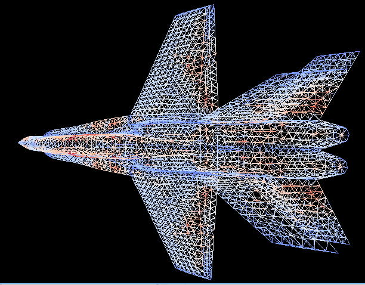
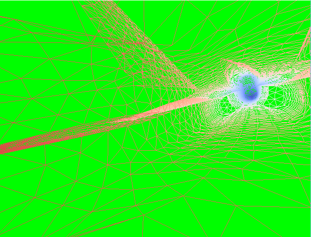
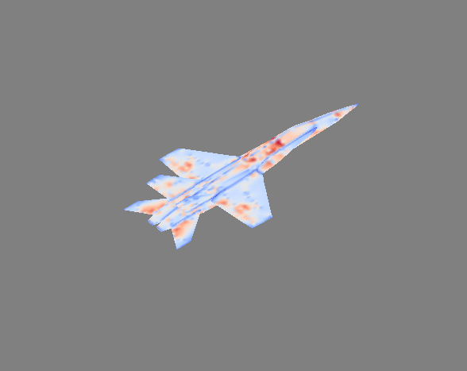

# 3D-Jet-Plane

## START UP
In the console…
- Enter x,y or z to set the colour map to a co-ordinate, or s to map to the colour variable.
- Enter o at the prompt for orthographic projection. Any other key entered will set a perspective projection.
- Enter a background colour. Allowed colours are: green, blue, cyan, magenta, gray, yellow, orange, pink, red, white or darkGray. Black is the default colour and is used for all other input.

## CONTROL
Translation  
- Hold left click and drag in the left half of the screen to translate left, drag in the right half of the screen to translate right. (X-translation)
- Hold right click and drag in the top half of the screen to translate up, drag in the bottom half of the screen to translate down (Y-translation)
- Use the mouse wheel to move closer to (back) or farther from (forward) the jet model. (Z-translation)

Rotation
- Moving the mouse in the top half of the screen will cause rotation around the X-axis in a positive direction, moving the mouse in the bottom half of the screen will cause rotation around the X-axis in a negative direction (X-roatation)
- The ‘a’ and ‘d’ keys can be used to rotate about the Y-axis (Y-rotation)
- The ‘w’ and ‘s’ keys can be used to rotate about the Z-axis (Z-rotation)

Left mouse click to switch between a WireFrame and Pseudo-Colouring.

